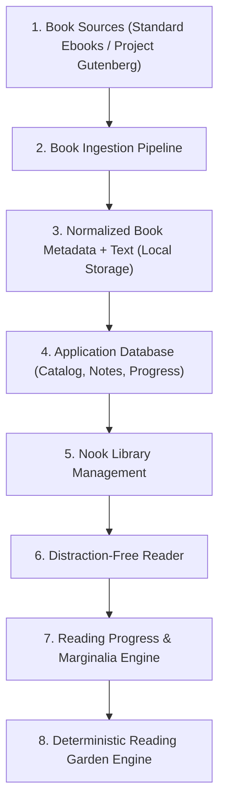
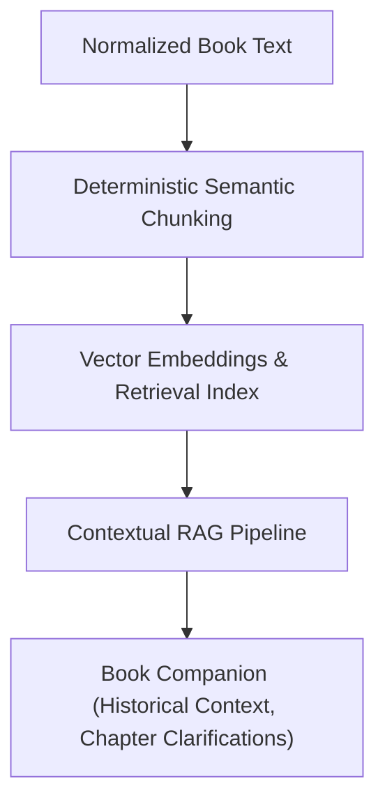
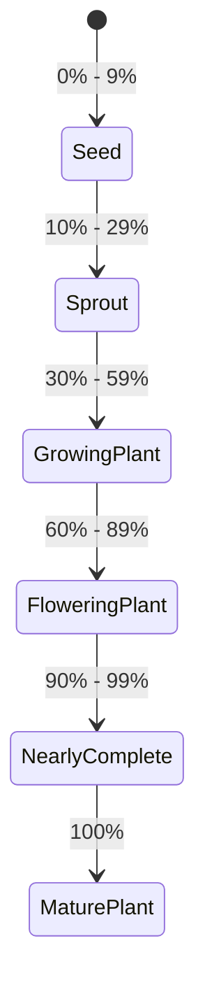

# Nook System Architecture & Technical Specifications 🏛️

This document outlines the planned architecture, system components, data schemas, and reliability guarantees for **Nook**.

---

## 1. System Architecture Overview

Nook is structured in decoupled, unidirectional data flows that ensure predictability, high testability, and clear separation of concerns.

### 🌿 Core Planned Architecture

The primary application lifecycle operates entirely deterministically without external cognitive or non-deterministic dependencies:



### 🧠 Optional AI Companion Architecture (Future Phase)

A future AI assistance layer is planned as an optional, strictly isolated, read-only enhancement. It will operate **only** on texts that Nook has legitimately ingested and stored locally:



---

## 2. Fundamental Architectural Principles

### 🔒 Complete Independence from AI
* **Zero AI in Core Logic:** Opening a book, paging through text, rendering typography, saving bookmarks, calculating reading percentage, recording notes, and advancing garden states **must never** depend on network calls to LLMs or vector databases.
* **Offline-First & Deterministic:** If the user has no internet connection or if the AI subsystem is disabled entirely, 100% of the core Nook experience remains functional and responsive.
* **Testability:** Core business logic (progress calculations, garden state transitions, metadata normalization) is strictly deterministic and verified by automated unit tests.

### 🛡️ Reliability & Data Integrity Rules
* **No Invented Metadata:** The system never synthesizes missing metadata fields (e.g. publication years or author names). If a source does not supply a field, it is handled explicitly as `null`/`unknown`.
* **Explicit Licensing Validation:** Records with missing, conflicting, or unknown license status are rejected by the ingestion validator.
* **Source Attribution Invariance:** Source identifier, origin repository, canonical URL, and public domain license declarations are immutable attributes attached to every book.
* **Idempotent Ingestion:** Re-running the ingestion pipeline on the same source book produces identical normalized output.

---

## 3. Planned Book Data Model

The following schema defines the normalized book record across the ingestion pipeline, database, and application interfaces:

| Field Name | Type | Description | Required | Example |
| :--- | :--- | :--- | :--- | :--- |
| `id` | `String (UUID/Slug)` | Unique internal identifier for the book in Nook | Yes | `"pride-and-prejudice-jane-austen"` |
| `title` | `String` | Full canonical title of the work | Yes | `"Pride and Prejudice"` |
| `author` | `String` | Author's canonical full name | Yes | `"Jane Austen"` |
| `language` | `String (ISO 639-1)` | Primary language code of the text | Yes | `"en"` |
| `description` | `String / Text` | Curated synopsis or public-domain blurb | No | `"A classic romantic novel following Elizabeth Bennet..."` |
| `cover` | `String (Path/URI)` | Relative path to local normalized cover image | No | `"covers/pride-and-prejudice.webp"` |
| `source` | `String (Enum)` | Origin archive repository | Yes | `"standard-ebooks"` \| `"project-gutenberg"` |
| `source_url` | `String (URL)` | Canonical URL of the original source page | Yes | `"https://standardebooks.org/ebooks/jane-austen/pride-and-prejudice"` |
| `source_identifier` | `String` | Origin archive's unique ID | Yes | `"jane-austen/pride-and-prejudice"` or `"1342"` |
| `license_or_rights` | `String` | Formal license or public domain declaration | Yes | `"Public Domain in the USA"` / `"CC0 1.0 Universal"` |
| `publication_year` | `Integer` | Original year of first publication | No | `1813` |
| `categories` | `Array<String>` | Curated genres and literary classifications | Yes | `["Romance", "Classics", "Satire"]` |
| `text_location` | `String (Path)` | Relative path to normalized clean text/EPUB file | Yes | `"data/books/pride-and-prejudice/content.json"` |
| `word_count` | `Integer` | Total verified word count of clean text | Yes | `122189` |
| `estimated_reading_time`| `Integer` | Estimated reading duration in minutes (calc: ~225 wpm) | Yes | `543` |

---

## 4. Planned Reading Progress & Garden State Model

Reading progression drives garden growth through a strictly deterministic state transition machine:



### Deterministic State Matrix

```typescript
// Architectural specification for garden state calculation
export type GardenStage = 
  | 'seed'             // 0% - 9%
  | 'sprout'           // 10% - 29%
  | 'growing_plant'    // 30% - 59%
  | 'flowering_plant'  // 60% - 89%
  | 'nearly_complete'  // 90% - 99%
  | 'mature_plant';    // 100%

export interface ReadingProgressRecord {
  bookId: string;
  currentPosition: number;      // Character offset or paragraph index
  totalLength: number;          // Total characters or paragraph count
  percentage: number;           // Calculated: (currentPosition / totalLength) * 100
  gardenStage: GardenStage;     // Derived deterministically from percentage
  lastReadAt: string;           // ISO 8601 Timestamp
}
```

---

## 5. System Components & Module Boundaries

### Ingestion Pipeline (`/ingestion`)
* **Adapters:** Source-specific extractors for Standard Ebooks (EPUB/XML parsing) and Project Gutenberg (clean text extraction, header/footer stripping).
* **Sanitizer & Validator:** Enforces schema rules, strips OCR anomalies, computes word count, verifies attribution fields, and converts texts into normalized reading JSON.

### Database Layer (`/database`)
* Lightweight, reliable relational storage (e.g. SQLite for local resilience).
* Stores catalog metadata, user reading progress, bookmarks, and marginalia notes.

### Backend API (`/backend`)
* Provides deterministic endpoints for library listing, book content streaming, progress updating, and notes retrieval.

### Frontend & Reader (`/frontend`)
* Single-page or server-rendered cozy reading application.
* Implements typography rendering, chapter navigation, marginalia tools, and the visual Reading Garden.

### AI Layer (`/ai`) — *Future Phase*
* Sandboxed subsystem that indexes stored book content locally.
* Uses semantic retrieval (RAG) to answer questions exclusively about the text being read, preventing hallucination outside the book's verified content.
